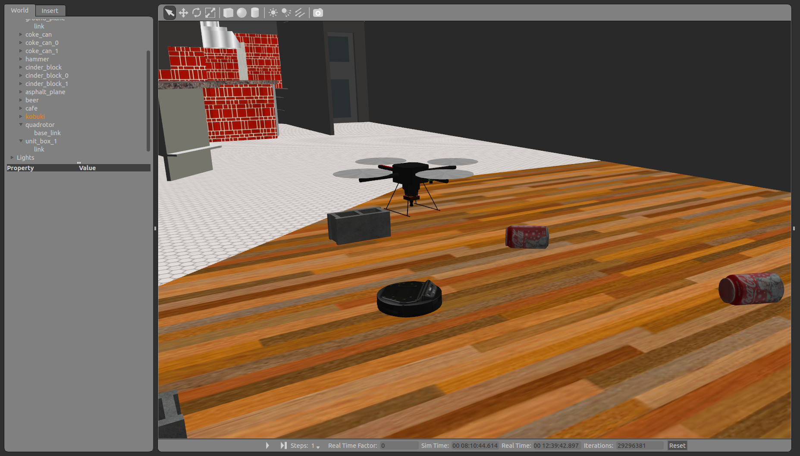
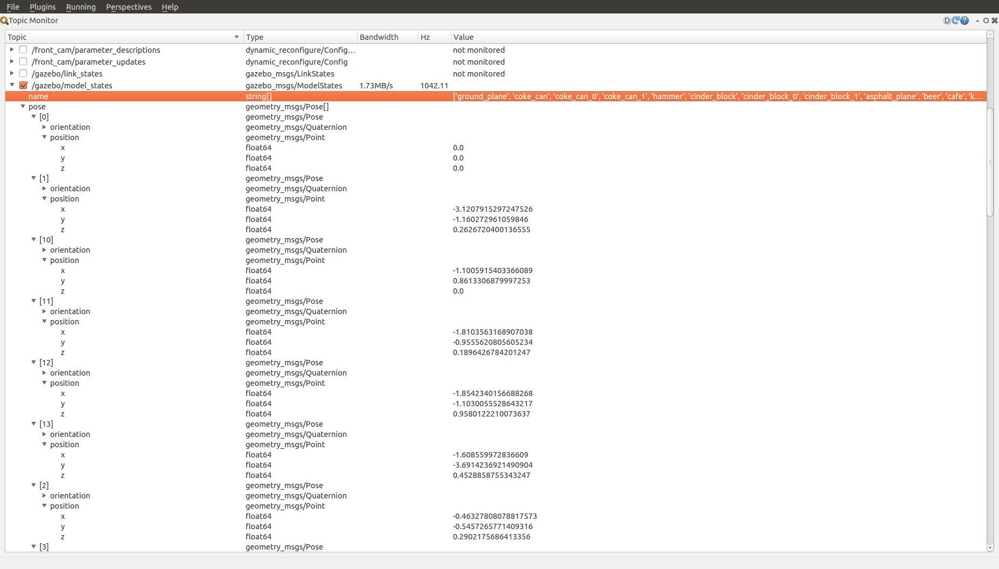

# Subscribe gazebo state

gazebo上にある物体の物体の位置は`gazebo/model_states`で配信されているので
それをSubscribeするためのコード．
また，関数`pos2csv`は得られた位置情報を.xlsxで保存する．

## 詳細

```cpp
void chatterCallback(const gazebo_msgs::ModelStatesPtr& model_states)
```

topic:`gazebo/model_states`のメーッセージの型は`gazebo_msgs::ModelStates`なので，コールバック関数には`gazebo_msgs::ModelStatesPtr`を引数に取るようにしている．

```cpp
if (model_states->name[i] == "kobuki")
```

ここでは，位置情報を知りたいモデルの名前を記述する．
例えば，gazebo内のkobukiの位置が欲しければ`kobuki`とする．


topicモニターでは一度にすべてのトピックを見ることができる．
```bash
$ rosrun rqt_topic rqt_topic
```
